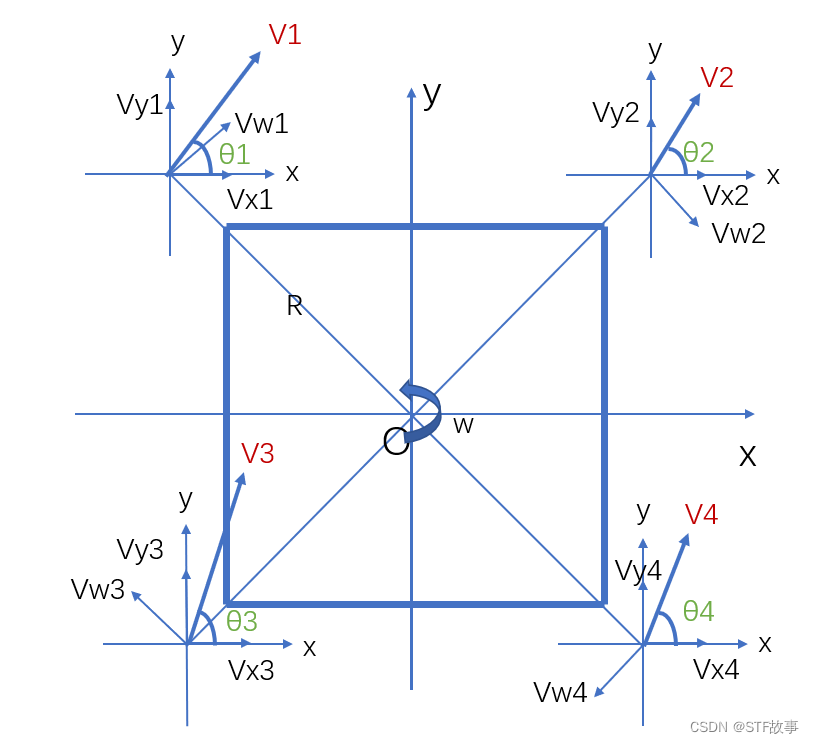

# 任务四：底盘控制 - 驱动 CAN 总线电机/PID 控制器

## 📃 任务描述

驱动一个舵轮底盘进行全向运动。

## 参考步骤

1. 学习驱动 CAN 总线电机：让一个 6020 云台电机转起来，并且顺利接收它反馈回来的信息，如位置、转速等等

2. 学习使用 PID 控制器闭环控制电机角度：类比参考资料里 PID 课程提到的”控制无人机高度“的例子，使用附录里给出的 PID 控制器来控制 6020 电机的位置

3. 学习使用 FreeRTOS：让单片机可以并行执行多个任务。

4. 学习使用 UART：接收 DT7 遥控器和 DR16 接收机发来的控制量。

5. 完成底盘控制：进行四舵轮底盘正运动学解算，结合解算结果和 pid 控制器，让底盘根据遥控器的输入进行运动。



## 🔗 参考资料

- [RoboMaster 开发板 C 型用户手册](https://rm-static.djicdn.com/tem/35228/RoboMaster%20%20开发板%20C%20型用户手册.pdf)

- [通俗易懂的 PID 控制算法讲解](https://www.bilibili.com/video/BV1et4y1i7Gm)

- [RoboMaster/Development-Board-C-Examples](https://github.com/RoboMaster/Development-Board-C-Examples)

- [DT7&DR16 2.4GHz 遥控接收系统用户手册](https://rm-static.djicdn.com/tem/4.RoboMaster%20%E6%9C%BA%E5%99%A8%E4%BA%BA%E4%B8%93%E7%94%A8%E9%81%A5%E6%8E%A7%E5%99%A8%EF%BC%88%E6%8E%A5%E6%94%B6%E6%9C%BA%EF%BC%89%E7%94%A8%E6%88%B7%E6%89%8B%E5%86%8C.pdf)

## 附录

### PID 控制器实现

```c
typedef struct {
    double kp;  // 比例系数
    double ki;  // 积分系数
    double kd;  // 微分系数
    double previous_error;  // 上一次误差
    double integral;  // 积分累积
    double output;    // 输出
} pid_t;

void PidInit(pid_t *pid, double kp, double ki, double kd) {
    pid->kp = kp;
    pid->ki = ki;
    pid->kd = kd;
    pid->previous_error = 0.0;
    pid->integral = 0.0;
}

void PidUpdate(pid_t *pid, double setpoint, double measured_value, double dt) {
    double error = setpoint - measured_value;
    pid->integral += error * dt;
    double derivative = (error - pid->previous_error) / dt;
    double output = pid->kp * error + pid->ki * pid->integral + pid->kd * derivative;
    pid->previous_error = error;
    pid->output = output;
}
```
